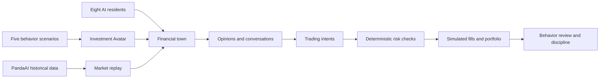
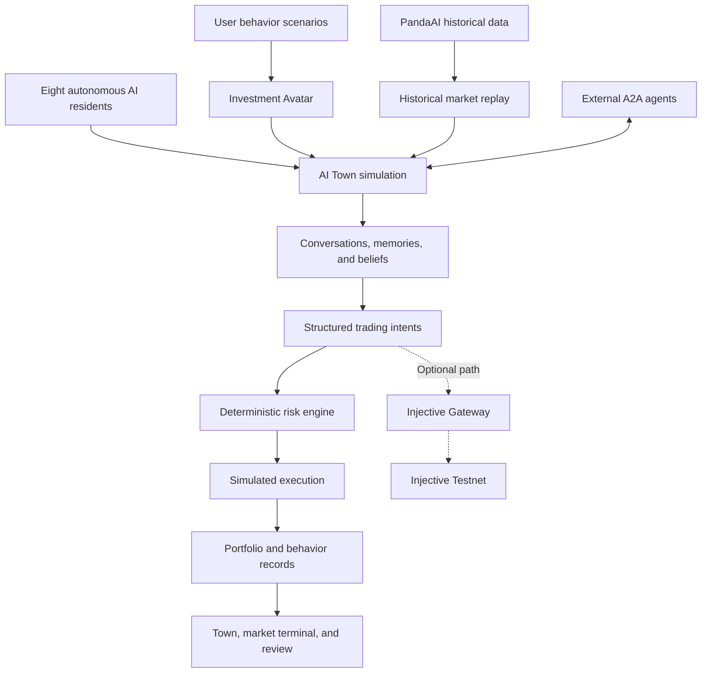

# Injective Trade Town

**English** | [简体中文](README.zh-CN.md)

> Create your AI investment Avatar, place it in real historical markets, and
> observe how it responds to rumors, volatility, herd behavior, and portfolio
> risk.

**Injective Trade Town** is a financial town where autonomous AI residents
live, talk, form opinions, and trade together.

You can create an investment Avatar through a set of behavioral scenarios,
then send it into the town to experience real historical market conditions
alongside other AI residents. Their conversations, information flow, and
reactions turn otherwise invisible investment behavior into something you can
observe and review.

The goal is not to predict the next winning stock. It is to explore a question
that is closer to real investing:

> When the market is under pressure, how long will your investment discipline
> hold?

- Live demo: [https://tradetown.net](https://tradetown.net)
- A2A Agent Card:
  [View Agent Card](https://tradetown.net/.well-known/agent-card.json)
- Service status: [Health Check](https://tradetown.net/healthz)

---

## The problem we want to solve

Many investors know that they should diversify, control risk, and avoid chasing
prices. Under real market pressure, however, fear, greed, social influence, and
overconfidence can still push them away from their own rules.

Traditional backtests usually evaluate:

- how a strategy performed on historical prices;
- whether a set of parameters worked; and
- whether buy and sell signals beat a benchmark.

They rarely test:

- whether you would sell when everyone around you turns bearish;
- whether you would ignore risk limits after a rapid price increase;
- whether you would act on a rumor before checking it; or
- whether a loss would make you abandon your original discipline.

Injective Trade Town turns these hidden behavioral processes into experiments
that can be observed and reviewed.

---

## Create your investment Avatar

You begin with five investment-behavior scenarios that establish the profile
of your Avatar.

The scenarios explore tendencies such as:

- risk tolerance;
- reactions to losses;
- reliance on popular opinions;
- portfolio concentration; and
- trading discipline and emotional sensitivity.

Once created, your Avatar enters the town as its ninth resident and joins eight
autonomous AI residents.

The Avatar is not just a chat character. It represents the decisions and
trading reactions that a person with the current behavioral profile might make.

---

## How a behavioral stress test works



A complete experiment follows this flow:

1. You create an investment Avatar.
2. The system selects a historical market dataset and starts the replay.
3. Residents observe prices, events, and other residents' opinions.
4. Information spreads through conversations inside the town.
5. Residents form trading intents based on their personalities, memories, and
   risk preferences.
6. The risk engine checks cash, holdings, concentration, and order constraints.
7. The system produces simulated fills, positions, and profit-and-loss changes.
8. You review how the Avatar behaved under pressure.
9. The review surfaces herd behavior, panic, overtrading, concentration, and
   deviations from discipline.
10. You can use those observations to define clearer rules for future
    experiments.

---

## Why a town?

A financial market is not only a price chart. It is a social system made of
people, opinions, relationships, and information.

The same event can have different effects depending on how it spreads:

- a cautious resident may wait for more evidence;
- a trend follower may react immediately;
- a socially influenced resident may copy a neighbor;
- a risk-seeking resident may increase a position; and
- your Avatar may change its original decision under group pressure.

By placing agents in a visual town, you can observe:

- who formed an opinion first;
- how information moved through the population;
- which residents influenced the Avatar;
- whether a trade was triggered by price, an event, or social propagation; and
- when the Avatar departed from its original discipline.

The town makes the behavioral mechanisms behind an outcome visible.

---

## Core features

### Investment Avatar

- Build a behavioral profile from investment scenarios.
- Turn that profile into an active AI Avatar.
- Observe the Avatar across different market stresses.
- Review behavioral risks and potential discipline rules.

### Autonomous AI residents

- Eight residents with different personalities, risk preferences, and trading
  styles.
- Residents can move, talk, form memories, and update their beliefs.
- Opinions spread through conversations and social relationships.
- Trading intents retain explainable links to the reasoning that produced them.

### Historical market replay

The project currently includes five PandaAI historical A-share datasets.

- Each dataset contains 304 trading days.
- Markets replay in chronological order.
- Residents react differently to the same historical conditions.
- Different Avatars and experimental conditions can be compared.

### Explainable trading and risk controls

The path from information to a position is explicit:

```text
Market information
  → resident beliefs
  → conversations and propagation
  → trading intent
  → risk checks
  → simulated order
  → simulated fill
  → portfolio change
```

The deterministic risk engine checks:

- available cash;
- current holdings;
- order size;
- single-asset concentration;
- configured risk limits; and
- duplicated or conflicting intents.

### Behavior review

After an experiment, you can examine:

- whether the Avatar followed the crowd;
- whether short-term volatility repeatedly changed its decisions;
- whether it acted before a rumor was verified;
- whether its portfolio became overconcentrated;
- whether it crossed its original risk boundaries; and
- which rules might help it stay disciplined in another run.

---

## Data and simulation boundaries

The project explicitly separates historical data, simulated behavior, and
on-chain records.

| Content | Type | Meaning |
| --- | --- | --- |
| PandaAI historical candlesticks | Historical data | Data from real historical markets |
| Agent beliefs and conversations | Simulated content | Generated from the residents and experiment state |
| Trading intents | Simulated content | Actions residents would like to take |
| Local orders and fills | Simulated content | Used for behavioral experiments and portfolio calculations |
| Portfolio and profit and loss | Simulated result | Does not represent assets in a real account |
| Injective transactions | Optional on-chain record | Exists only when the Gateway and testnet execution are explicitly enabled |

Simulated fills are not presented as real market executions, and results from a
historical replay are not presented as predictions of future returns.

Injective Trade Town is a behavioral research, decision-training, and
engineering experiment. It does not provide investment advice.

---

## Architecture



The main components are:

- **React, TypeScript, and Vite** for the frontend;
- **PixiJS** for the visual town and residents;
- **Convex** for real-time state, conversations, memories, and experiment data;
- **PandaAI datasets** for historical market replay;
- an **OpenAI-compatible API** for resident conversations and reasoning;
- an **A2A Remote Agent** for external agent access;
- a **Cloudflare Worker** for the production frontend and A2A service; and
- an **Injective Gateway** for the optional testnet execution path.

Read the detailed design in
[docs/ARCHITECTURE.md](docs/ARCHITECTURE.md).

---

## A2A Remote Agent

Injective Trade Town can be called by other agents and applications as an A2A
Remote Agent.

Five skills are currently available:

| Skill ID | Capability |
| --- | --- |
| `town-agent-history` | Inspect the historical behavior and records of town residents |
| `panda-market-replay` | Run a PandaAI historical market replay |
| `rate-shock-experiment` | Run an interest-rate shock experiment |
| `rumor-propagation-analysis` | Analyze how a rumor spreads through the town |
| `user-behavior-review` | Review the behavior and risk tendencies of a user's Avatar |

Live endpoints:

- Agent Card:
  [https://tradetown.net/.well-known/agent-card.json](https://tradetown.net/.well-known/agent-card.json)
- Health Check:
  [https://tradetown.net/healthz](https://tradetown.net/healthz)

The Cloudflare Worker serves both the static frontend and the A2A service.
Convex persists A2A tasks and artifacts.

See
[docs/CLOUDFLARE_WORKER_DEPLOYMENT.md](docs/CLOUDFLARE_WORKER_DEPLOYMENT.md)
for deployment instructions.

---

## Injective Testnet

Injective is currently an **optional, verifiable execution path**, not the
settlement layer for the default historical simulation.

The default experiment uses:

- PandaAI historical market data;
- local trading intents;
- deterministic risk checks; and
- simulated orders, fills, and portfolios.

When the Injective Gateway is explicitly configured, eligible trading intents
can be submitted to Injective Testnet to explore verifiable execution and
on-chain settlement.

Run a read-only connectivity check:

```bash
npm run gateway:check
```

Preview the TokenFactory and market provisioning plan without signing:

```bash
npm run provision:plan
```

The Gateway is read-only by default. This repository does not contain a wallet
or private key, and provisioning or signing must be explicitly enabled by an
operator.

Follow
[docs/TESTNET_OPERATIONS.md](docs/TESTNET_OPERATIONS.md)
for detailed instructions. Never use a mainnet private key for this project.

---

## Run locally

### Requirements

- Node.js 20.19+ or 22.12+
- npm

### Start the frontend preview

```bash
git clone https://github.com/zonghaoyuan/trade-town.git
cd trade-town
npm ci
npm run dev:frontend
```

Open:

```text
http://localhost:5173
```

Without `VITE_CONVEX_URL`, the application runs in a clearly labeled scenario
preview mode.

### Start the live town

Initialize a Convex deployment:

```bash
npx convex dev --once
```

Configure an OpenAI-compatible API for resident conversations:

```bash
npx convex env set LLM_API_URL 'https://your-provider.example/v1'
npx convex env set LLM_API_KEY 'your-api-key'
npx convex env set LLM_MODEL 'your-model'
npx convex env set LLM_EMBEDDING_MODEL 'local-hash'
```

Start the frontend and backend:

```bash
npm run dev
```

The system does not silently fall back to a local model. `LLM_API_URL` accepts
a provider host, a URL ending in `/v1`, or a full URL ending in
`/chat/completions`.

If the provider does not expose an embeddings endpoint, use:

```text
LLM_EMBEDDING_MODEL=local-hash
```

Residents call the configured model while the town is running. Use the
in-application **Freeze** control when an experiment is not active to avoid
consuming metered model quota in the background.

---

## Commands

```bash
npm run dev                  # Start Convex and the frontend
npm run dev:frontend         # Start only the frontend
npm run build                # TypeScript checks and production build
npm test -- --runInBand      # Run the automated test suite
npm run lint                 # Run ESLint
npm run a2a:dev              # Start the local A2A service
npm run a2a:examples         # Run the A2A example client
npm run gateway:check        # Read-only Injective Testnet check
npm run gateway:dev          # Start the Injective Gateway
npm run provision:plan       # Preview the testnet provisioning plan
npm run cf:deploy            # Deploy the Cloudflare Worker
```

---

## Origins and hackathon development

Injective Trade Town is built on the open-source simulation engine from
[a16z AI Town](https://github.com/a16z-infra/ai-town).

To preserve a clear and transparent project origin, the AI Town upstream
baseline is imported as the initial commit in this repository's history.

The project adds and extends:

- the financial-town visual environment;
- the user's investment Avatar;
- the five-scenario behavioral profile;
- eight financial AI residents;
- PandaAI historical market replay;
- financial beliefs, events, and memory models;
- information and rumor propagation between residents;
- structured trading intents;
- a deterministic portfolio risk engine;
- simulated orders, fills, positions, and profit and loss;
- behavior review and investment-discipline feedback;
- an A2A Remote Agent;
- Cloudflare Worker deployment;
- the optional Injective Testnet Gateway; and
- the market terminal, candlestick chart, and causal event replay interface.

Some financial-agent concepts are informed by
[TwinMarket](https://github.com/TwinMarketAI/TwinMarket), but this project does
not copy or use TwinMarket's local matching engine.

---

## Credits

- [AI Town](https://github.com/a16z-infra/ai-town): town simulation foundation
- [TwinMarket](https://github.com/TwinMarketAI/TwinMarket): financial-agent
  concept reference
- PandaAI: historical market data and A2A ecosystem
- [TradingView Lightweight Charts](https://github.com/tradingview/lightweight-charts):
  candlestick charts
- Kenney RPG Urban Pack: CC0 map assets
- Universal LPC Spritesheet Character Generator: character assets

Detailed asset sources and license information are available in
[public/assets/trade-town/licenses/ASSET-SOURCES.md](public/assets/trade-town/licenses/ASSET-SOURCES.md).

---

## License

Released under the [MIT License](LICENSE).

The original AI Town copyright notice and the Injective Trade Town contributor
notice are retained in the license file.
