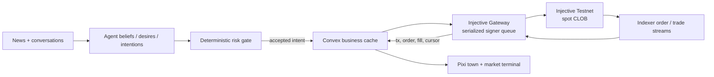

# Trade Town

An autonomous financial town where information spreads through AI conversations, becomes structured
trading intent, and settles on the Injective Testnet spot orderbook.

Trade Town keeps [AI Town](https://github.com/a16z-infra/ai-town) as the simulation engine and ports
the financial-agent semantics of [TwinMarket](https://github.com/TwinMarketAI/TwinMarket).
TwinMarket's local matcher is intentionally not used: Injective Testnet is the sole matching and
settlement authority.

## What is implemented

- A variable-size AI Town population, defaulting to 8 visible AI traders and 2 explicitly labeled
  deterministic market makers.
- TwinMarket-inspired belief → desire → intention logic, behavioral biases, explainable rationales,
  and a deterministic portfolio risk gate.
- A Convex finance domain separated from the real-time game document: markets, trader profiles,
  beliefs, events, intents, orders, fills, portfolios, transactions, and chain cursors.
- A standalone Node Gateway with a serialized signing queue, Injective Indexer streams, idempotent
  fill ingestion, and read-only mode by default.
- One operator wallet mapped to ten Injective subaccounts by nonce.
- A TokenFactory and spot-market provisioning plan for `TOWNUSD`, `ACME`, `NOVA`, `AURUM`, and
  `CRUDE`.
- An 8-bit exchange terminal wrapped around the live Pixi town, with market state, agent inspection,
  a causal event replay, and responsive candlestick charts.
- A standalone preview that works without Convex credentials.

The repository does **not** contain a wallet or private key and has not spent testnet listing fees.
The market catalogue remains `planned` until an operator funds a dedicated testnet wallet and runs
the explicit provisioning stages.

## Architecture



Convex remains the source of truth for town motion, conversations, memories, intent workflow, and a
reconciled UI cache. Only confirmed Injective fills may change official holdings.

Read the detailed design in [docs/ARCHITECTURE.md](docs/ARCHITECTURE.md).

## Quick start

Requirements: Node.js 20.19+ or 22.12+ and npm.

```bash
git clone https://github.com/zonghaoyuan/trade-town.git
cd trade-town
npm install
npm run dev:frontend
```

Open `http://localhost:5173`. Without `VITE_CONVEX_URL`, the UI runs in clearly labeled scenario
preview mode.

For a live town, configure Convex and the LLM provider as described in `.env.example`, then run:

```bash
npm run dev
```

The existing AI Town LLM adapters still support Ollama and OpenAI-compatible endpoints. The
financial order path is independent of the chat model. For a chat-only OpenAI-compatible gateway,
set `LLM_EMBEDDING_MODEL=local-hash`; this deterministic local fallback is suitable for demos but
does not provide production-grade semantic retrieval. `LLM_API_URL` accepts a host URL, a URL
ending in `/v1`, or a full URL ending in `/chat/completions`.

The live simulation calls the configured chat model while agents converse. Use the in-game
**Freeze** control when you are not actively testing so a metered API quota is not consumed in the
background.

## Injective Testnet

Check current testnet connectivity without a key:

```bash
npm run gateway:check
```

Preview all denoms, spot markets, and subaccount funding without signing:

```bash
npm run provision:plan
```

Provisioning and signing are opt-in. Follow [docs/TESTNET_OPERATIONS.md](docs/TESTNET_OPERATIONS.md)
to create the dedicated wallet, fund it, launch TokenFactory assets and markets, fund subaccounts,
and start the Gateway.

The SDK is pinned exactly to `@injectivelabs/sdk-ts@1.20.26`. Do not downgrade to the compromised
`1.20.21` release, and never use a mainnet key for this project.

## Market and agent defaults

| Type              | Members                                         |
| ----------------- | ----------------------------------------------- |
| Company markets   | `ACME/TOWNUSD`, `NOVA/TOWNUSD`                  |
| Commodity markets | `AURUM/TOWNUSD`, `CRUDE/TOWNUSD`                |
| AI agents         | Mira, Theo, Imani, Sora, Omar, Lin, Jules, Neha |
| Deterministic MMs | Delta-7 for companies, Sigma-2 for commodities  |

The default count is 10 and can be changed with `npx convex run init '{"numAgents": 16}'`, up to the
current safety cap of 32. Additional instances reuse a financial archetype but receive a unique town
name.

## Commands

```bash
npm run build              # TypeScript + production frontend
npm test -- --runInBand    # Existing engine tests + finance tests
npm run lint               # ESLint
npm run gateway:check      # Read-only Injective Testnet health check
npm run gateway:dev        # Long-running Gateway
npm run provision:plan     # Zero-signature provisioning preview
```

## Demo story

The included replay follows the hackathon narrative:

1. The town central bank raises rates.
2. A news agent publishes the decision.
3. Agents revise beliefs and spread them through conversations.
4. A trader emits a structured limit-order intent.
5. The risk layer accepts or blocks it.
6. The Gateway signs in sequence and submits to Injective.
7. The UI closes the causal chain only when the fill is confirmed.

See [docs/HACKATHON_DEMO.md](docs/HACKATHON_DEMO.md) for the operator runbook.

## Credits and license

Trade Town is a derivative of a16z's AI Town and retains its original credits and assets. Financial
agent concepts are adapted from TwinMarket without copying its off-chain exchange engine.
Candlestick rendering uses
[TradingView Lightweight Charts](https://github.com/tradingview/lightweight-charts) under
Apache-2.0, with the required attribution linked from the application footer.

Released under the [MIT License](LICENSE).
