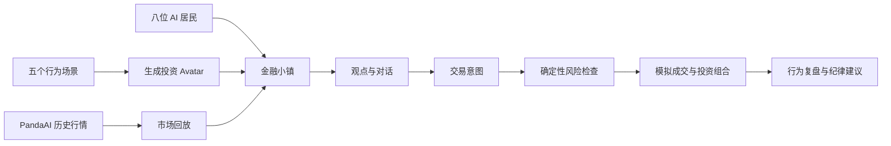
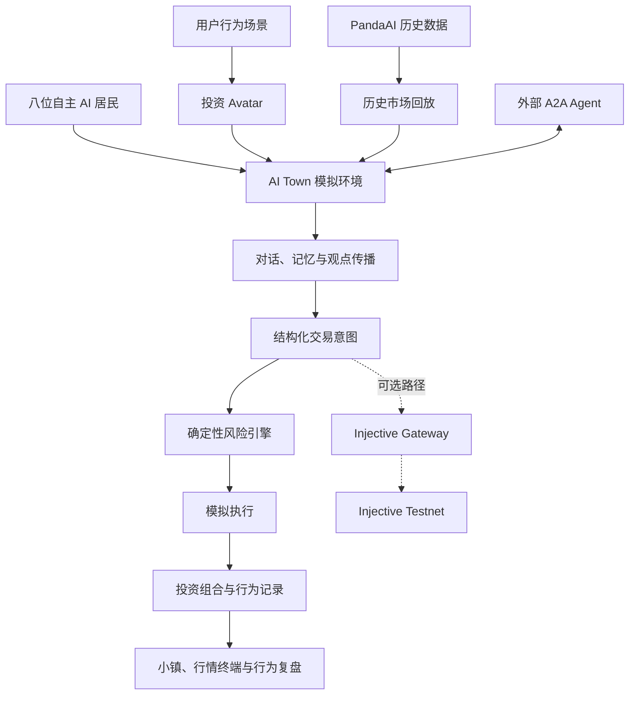

# Injective Trade Town

[English](README.md) | **简体中文**

> 创建你的 AI 投资 Avatar，把它放入真实历史市场，观察它如何面对传闻、波动、羊群效应与持仓风险。

**Injective Trade Town** 是一座由 AI 居民共同生活、交流和交易的金融小镇。

用户可以通过一组行为场景创建自己的投资 Avatar。Avatar 会进入小镇，与其他 AI 居民一起经历真实历史行情，在对话、消息传播和价格变化中形成观点与交易意图。

项目的目标不是预测下一只股票，而是回答一个更贴近真实投资的问题：

> 当市场压力真正出现时，你的投资纪律还能坚持多久？

- 在线体验：[https://tradetown.net](https://tradetown.net)
- A2A Agent Card：[查看 Agent Card](https://tradetown.net/.well-known/agent-card.json)
- 服务状态：[Health Check](https://tradetown.net/healthz)

---

## 我们想解决的问题

很多投资者知道应该分散持仓、控制风险、避免追涨杀跌，但在真实市场压力下，人们仍然可能因为恐慌、贪婪、从众或过度自信而偏离原有纪律。

传统回测通常测试的是：

- 一个策略在历史行情中的收益
- 某组参数是否有效
- 买卖信号是否能够跑赢基准

但它很少测试：

- 当周围的人都在看空时，你是否会跟随他们卖出
- 当价格连续上涨时，你是否会忽略风险限制
- 当传闻快速传播时，你是否会在验证信息前采取行动
- 当持仓亏损时，你是否会改变原本的投资规则

Injective Trade Town 将这些不可见的行为过程变成一个可以观察和复盘的实验。

---

## 创建你的投资 Avatar

用户首先通过五个投资行为场景建立自己的 Avatar。

这些场景用于识别用户在不同市场环境中的倾向，例如：

- 风险承受能力
- 面对亏损时的反应
- 对热门观点的依赖程度
- 持仓集中倾向
- 交易纪律与情绪敏感度

完成创建后，Avatar 会进入小镇，成为第九位居民，与八位自主 AI 居民一起生活、交流并参与市场。

Avatar 不是一个简单的聊天角色。它代表用户在当前行为画像下，可能做出的判断和交易反应。

---

## 一次行为压力测试如何进行



一次完整实验包括以下步骤：

1. 用户创建自己的投资 Avatar。
2. 系统选择一个历史市场数据集并开始回放。
3. 小镇居民观察价格、新闻和其他居民的观点。
4. 信息通过居民之间的对话在小镇中传播。
5. 居民根据自身性格、记忆和风险偏好形成交易意图。
6. 风险引擎检查仓位、现金、集中度和订单约束。
7. 系统产生模拟成交、持仓和盈亏变化。
8. 用户回顾 Avatar 在压力下的行为。
9. 系统帮助用户识别从众、恐慌、过度交易或纪律偏离。
10. 用户可以据此建立更明确的投资规则。

---

## 为什么是一座小镇？

金融市场不仅是价格曲线，也是一套由人、观点和关系组成的社会系统。

同一条消息可能因为传播路径不同而产生完全不同的影响：

- 一位谨慎的居民可能等待更多证据
- 一位趋势型居民可能迅速跟随市场
- 一位容易从众的居民可能受到邻居观点影响
- 一位高风险偏好的居民可能扩大仓位
- 用户的 Avatar 也可能在群体压力下改变原有判断

通过把 Agent 放入可视化小镇，用户可以直接观察：

- 谁最先形成某个观点
- 信息如何在人群中扩散
- 哪些居民影响了 Avatar
- 一次交易是由价格、新闻还是社会传播触发
- Avatar 在什么时刻偏离了原定纪律

小镇让原本隐藏在结果背后的行为过程变得可见。

---

## 核心功能

### 投资 Avatar

- 通过行为场景建立用户画像
- 将用户的投资倾向转化为可运行的 AI Avatar
- 观察 Avatar 在不同市场压力下的反应
- 提供行为复盘和纪律建议

### 自主 AI 居民

- 八位拥有不同性格、风险偏好和投资风格的居民
- 居民能够移动、交流、形成记忆并更新观点
- 观点可以通过对话和社交关系传播
- 每个交易意图都可以关联到相应的判断依据

### 历史市场回放

项目当前包含五个 PandaAI A 股历史行情数据集。

- 每个数据集包含 304 个交易日
- 行情按照时间顺序回放
- 居民在相同的历史市场条件下做出不同反应
- 用户可以比较不同 Avatar 或不同实验条件下的行为差异

### 可解释交易与风险控制

从观点到持仓的过程被拆分为：

```text
市场信息
  → 居民观点
  → 对话与传播
  → 交易意图
  → 风险检查
  → 模拟订单
  → 模拟成交
  → 投资组合变化
```

风险引擎采用确定性规则检查：

- 可用现金
- 当前持仓
- 订单规模
- 单一资产集中度
- 风险限制
- 重复或冲突的交易意图

### 行为复盘

实验结束后，用户可以关注：

- Avatar 是否出现羊群效应
- 是否因为短期波动频繁改变判断
- 是否在传闻未经验证时采取行动
- 是否形成过度集中的持仓
- 是否突破自己原本设定的风险边界
- 哪些规则可以帮助 Avatar 在下一次实验中保持纪律

---

## 数据与模拟边界

项目明确区分真实数据、模拟行为和链上记录。

| 内容 | 类型 | 说明 |
| --- | --- | --- |
| PandaAI 历史 K 线 | 历史数据 | 来自真实历史市场的数据 |
| Agent 观点与对话 | 模拟内容 | 由 AI 居民根据实验环境生成 |
| 交易意图 | 模拟内容 | 表示居民希望采取的操作 |
| 本地订单与成交 | 模拟内容 | 用于行为实验和投资组合计算 |
| 投资组合与盈亏 | 模拟结果 | 不代表真实账户资产 |
| Injective 交易记录 | 可选链上记录 | 仅在显式启用 Gateway 和测试网执行时产生 |

项目不会将模拟成交描述为真实市场成交，也不会将历史行情中的实验结果描述为未来收益预测。

Injective Trade Town 是行为研究、决策训练和技术实验工具，不构成任何投资建议。

---

## 系统架构



系统的主要组成部分包括：

- **React、TypeScript 和 Vite**：前端应用
- **PixiJS**：小镇场景和居民可视化
- **Convex**：实时状态、对话、记忆及实验数据
- **PandaAI 数据集**：历史行情回放
- **OpenAI-compatible API**：居民对话与推理
- **A2A Remote Agent**：外部 Agent 接入
- **Cloudflare Worker**：生产环境前端和 A2A 服务
- **Injective Gateway**：可选的测试网验证执行路径

详细设计参见 [docs/ARCHITECTURE.md](docs/ARCHITECTURE.md)。

---

## A2A Remote Agent

Injective Trade Town 可以作为 A2A Remote Agent 被其他 Agent 或应用调用。

当前提供五项技能：

| Skill ID | 能力 |
| --- | --- |
| `town-agent-history` | 查询小镇居民的历史行为和记录 |
| `panda-market-replay` | 运行 PandaAI 历史市场回放 |
| `rate-shock-experiment` | 运行利率冲击行为实验 |
| `rumor-propagation-analysis` | 分析传闻在居民之间的传播 |
| `user-behavior-review` | 复盘用户 Avatar 的行为和风险倾向 |

线上入口：

- Agent Card：
  [https://tradetown.net/.well-known/agent-card.json](https://tradetown.net/.well-known/agent-card.json)
- Health Check：
  [https://tradetown.net/healthz](https://tradetown.net/healthz)

Cloudflare Worker 同时提供静态前端和 A2A 服务。A2A Task 与 Artifact 通过 Convex 持久化。

部署说明参见：

[docs/CLOUDFLARE_WORKER_DEPLOYMENT.md](docs/CLOUDFLARE_WORKER_DEPLOYMENT.md)

---

## Injective Testnet

Injective 目前是项目中的**可选验证执行路径**，不是默认历史模拟的结算层。

默认实验使用：

- PandaAI 历史行情
- 本地交易意图
- 确定性风险检查
- 模拟订单、成交和投资组合

在显式配置 Injective Gateway 后，项目可以将符合条件的交易意图提交到 Injective Testnet，用于研究可验证执行和链上结算。

只读检查：

```bash
npm run gateway:check
```

预览 TokenFactory 和市场创建计划，不执行签名：

```bash
npm run provision:plan
```

Gateway 默认使用只读模式。仓库不包含钱包或私钥，市场创建和签名操作必须由操作者显式启用。

详细操作参见：

[docs/TESTNET_OPERATIONS.md](docs/TESTNET_OPERATIONS.md)

请勿为本项目使用主网私钥。

---

## 本地运行

### 环境要求

- Node.js 20.19+ 或 22.12+
- npm

### 启动前端预览

```bash
git clone https://github.com/zonghaoyuan/trade-town.git
cd trade-town
npm ci
npm run dev:frontend
```

打开：

```text
http://localhost:5173
```

如果没有配置 `VITE_CONVEX_URL`，应用会以明确标识的场景预览模式运行。

### 启动完整小镇

首先初始化 Convex：

```bash
npx convex dev --once
```

配置用于居民对话的 OpenAI-compatible API：

```bash
npx convex env set LLM_API_URL 'https://your-provider.example/v1'
npx convex env set LLM_API_KEY 'your-api-key'
npx convex env set LLM_MODEL 'your-model'
npx convex env set LLM_EMBEDDING_MODEL 'local-hash'
```

启动前后端：

```bash
npm run dev
```

系统不会自动回退到本地模型。`LLM_API_URL` 可以使用：

- 服务域名
- 以 `/v1` 结尾的地址
- 以 `/chat/completions` 结尾的完整地址

如果服务不提供 Embeddings API，可以使用：

```text
LLM_EMBEDDING_MODEL=local-hash
```

居民会在小镇运行期间调用配置的模型。停止实验时，可以使用界面中的 **Freeze** 控件冻结模拟，避免继续消耗模型额度。

---

## 常用命令

```bash
npm run dev                  # 启动 Convex 和前端
npm run dev:frontend         # 仅启动前端
npm run build                # TypeScript 检查与生产构建
npm test -- --runInBand      # 运行自动化测试
npm run lint                 # 运行 ESLint
npm run a2a:dev              # 启动本地 A2A 服务
npm run a2a:examples         # 运行 A2A 示例客户端
npm run gateway:check        # Injective Testnet 只读检查
npm run gateway:dev          # 启动 Injective Gateway
npm run provision:plan       # 预览测试网配置计划
npm run cf:deploy            # 部署 Cloudflare Worker
```

---

## 项目来源与黑客松开发内容

Injective Trade Town 基于
[a16z AI Town](https://github.com/a16z-infra/ai-town)
的开源模拟引擎开发。

为了保留清晰、透明的项目来源，AI Town upstream baseline 在当前仓库历史中作为初始提交导入。

在该基础上，本项目实现和扩展了：

- 金融小镇视觉场景
- 用户投资 Avatar
- 五场景行为画像
- 八位金融 AI 居民
- PandaAI 历史行情回放
- 金融观点、事件和记忆模型
- 居民之间的信息与传闻传播
- 结构化交易意图
- 确定性投资组合风险引擎
- 模拟订单、成交、持仓和盈亏
- 行为复盘与纪律建议
- A2A Remote Agent
- Cloudflare Worker 部署
- 可选 Injective Testnet Gateway
- 金融终端、K 线和因果事件回放界面

金融 Agent 的部分概念参考了
[TwinMarket](https://github.com/TwinMarketAI/TwinMarket)，
但项目没有复制或使用 TwinMarket 的本地撮合引擎。

---

## Credits

- [AI Town](https://github.com/a16z-infra/ai-town)：小镇模拟基础
- [TwinMarket](https://github.com/TwinMarketAI/TwinMarket)：金融 Agent 概念参考
- PandaAI：历史行情数据与 A2A 生态
- [TradingView Lightweight Charts](https://github.com/tradingview/lightweight-charts)：K 线图表
- Kenney RPG Urban Pack：CC0 地图素材
- Universal LPC Spritesheet Character Generator：角色素材

详细素材来源和许可证参见：

[public/assets/trade-town/licenses/ASSET-SOURCES.md](public/assets/trade-town/licenses/ASSET-SOURCES.md)

---

## License

项目使用 [MIT License](LICENSE)。

原始 AI Town 版权声明和 Injective Trade Town 贡献者声明均保留在许可证文件中。
