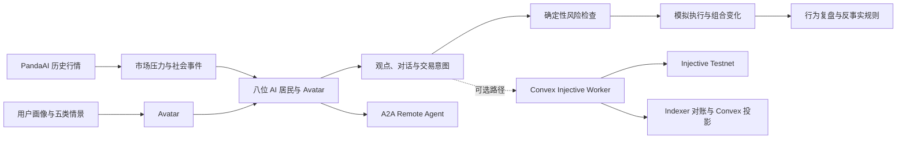

# Injective Trade Town｜AdventureX 项目提交总稿

> 让你的 Avatar 先走进市场，在一次次波动中看见自己的投资性格与决策风险。

- **项目定位：** 可视化的个人投资行为压力测试与决策训练平台
- **体验地址：** [tradetown.net](https://tradetown.net/)

技术上，我们把 PandaAI 历史行情、个人 Avatar、确定性风控和 A2A
Agent 放进同一座小镇，并使用 Injective 官方 SDK 实现测试网只读连通检查与可选执行代码。Superun 帮助我们验证产品闭环，Kiro 和 Qoder 参与后续工程实现。

## 我们想解决的问题

普通投资者真正难以回答的，往往不是“下一只股票会不会涨”，而是：

- 市场突然下跌时，我会不会因为恐慌卖出？
- 错过一轮上涨后，我会不会因为焦虑追高？
- 当群聊、新闻和其他投资者都在看多时，我还会不会核验信息？
- 连续盈利后，我会不会高估自己，悄悄突破原来的仓位纪律？
- 我自称可以承受 20% 的回撤，真正看到亏损时还能否坚持？

传统风险问卷记录的是用户如何评价自己，却很难呈现人在连续压力中的选择。Injective Trade
Town 想做的，不是再给用户一份分数，而是让这份自我描述变成一个会行动的 Avatar，在模拟的金融小镇中观察其投资历程。

## 把另一个自己送进金融小镇

用户创建自己的像素角色，并设置投资目标、投资期限、最大可接受回撤、观点确信度、群体影响度和损失厌恶度。

随后，用户需要面对五个具体情景：

- 市场单日暴跌 12%；
- 错过一轮快速上涨；
- 多数 Agent 同时买入；
- 核心投资逻辑受到质疑；
- 突然获得一笔可投资现金。

这些选择会被转化为 Avatar 的风险容忍度、现金缓冲、单仓上限、参考持有周期、社交信号权重和止损纪律。完成画像后，其 Avatar 会作为第九位居民进入小镇，与八位拥有不同投资风格的 AI 居民共同经历市场变化。

## 为什么要做成一座小镇

在传统行情软件里，用户只能看到价格结果；在小镇里，决策过程本身是可见的。

- 行情变化是居民共同面对的环境；
- 新闻和观点通过居民对话传播；
- 不同投资风格会对同一信息产生不同理解；
- BUY、SELL 和 HOLD 是角色在压力下做出的行动；
- 现金不足、订单过大或持仓过度集中，会触发明确的风控拦截；
- 每个交易日都可以暂停、回放和比较。

八位居民分别关注宏观、价值、趋势、新闻、商品、行为金融、组合管理和市场风险。他们不是八个重复的聊天机器人，而是八种不同的观察方式。用户可以看到某条消息如何改变居民的观点，又如何进一步影响仓位与交易意图。

## 一次压力测试会发生什么

假设市场突然下跌，Avatar 首先读取 PandaAI 历史行情和技术指标，再结合自己的风险画像与小镇中的群体观点形成判断。

系统会记录：

- 决策前后的观点变化；
- 支撑判断的行情与证据；
- BUY、SELL 或 HOLD 的理由与置信度；
- 当前现金、仓位、净值与盈亏；
- 被风控拒绝或缩小的交易；
- 同一输入在不同规则下产生的反事实结果。

Agent 模型与规则层负责形成观点和目标敞口，确定性金融规则负责计算数量、检查现金、限制单笔规模和持仓集中度。默认体验中的订单、成交和组合均为模拟结果；代码另有一条可选的 Injective 测试网路径，由 Convex
Node Action 承接通过风控的结构化交易意图。该路径必须由运营者配置市场和签名模式后才会提交交易。

## 从“看见问题”到“建立纪律”

压力测试的结果不是一条买卖建议，而是一组可以在情绪最强烈时保护用户的规则，例如：

- 单笔交易不超过净资产的一定比例；
- 保留最低现金缓冲；
- 群体情绪较强时要求两个独立信源；
- 冲动交易前增加冷静期；
- 对比加入仓位限制前后的结果；
- 对比立即交易与等待确认后的风险暴露。

Injective Trade Town 希望把“我可能有点从众”这样的模糊感受，变成一条可以观察、复盘和执行的决策纪律。

## 数据、模拟与记录边界

项目目前使用 PandaAI 提供的五只 A 股真实历史日线，覆盖 304 个交易日。真实行情负责提供连续的市场压力环境，居民观点、模拟订单、模拟成交和组合收益则由小镇生成，并在界面和报告中明确标记。

项目同时探索了让结构化交易意图进入可验证执行环境的路径。仓库中实现了由 Convex
Cron 调度的可选 Injective
Worker，代码支持测试网连接检查、Spot 限价单构造与提交、Indexer 查询和链上状态对账。它不是独立部署的 Gateway；当前默认模式也不会把模拟订单描述成链上交易。系统始终区分三类信息：

1. 有来源的历史市场事实；
2. Agent 生成的模拟观点与行为；
3. 可被验证的正式记录。

没有经过验证的模拟结果，不会被描述成真实成交。本项目用于金融仿真、行为观察和决策训练，不构成现实投资建议或收益承诺。

## A2A：让外部 Agent 进入实验

除可视化小镇外，项目还提供可公开发现和调用的 A2A Remote Agent。目前包含五类 Skill：

- PandaAI 历史行情回放；
- 利率冲击实验；
- 谣言传播与更正分析；
- 用户 Avatar 行为复盘；
- 单个 Agent 的多交易日历史数据。

每次任务都会返回输入、证据、运行步骤、风险结论和模拟声明。DeepSeek V4
Pro 负责理解任务、规划 Skill 与整理报告，金融计算、风险检查和历史数据读取由可复算的确定性工具完成。

- Agent Card：<https://tradetown.net/.well-known/agent-card.json>
- A2A 服务：<https://tradetown.net/a2a/v1>
- 服务说明：<https://tradetown.net/docs>

## 系统架构

主要技术包括 React、TypeScript、Vite、PixiJS、Convex、PandaAI 历史数据、A2A TypeScript
SDK，以及 Injective SDK、Indexer 与 Convex Node Action。

## 我们如何完成这个项目

我们先用 Superun 制作 Demo，验证“创建 Avatar—进入市场—观察行为—获得反馈”这条体验是否成立。在后续开发中，我们使用 Kiro 和 Qoder 协助拆解需求、编写前后端功能、补充测试并处理工程问题。

人的工作并没有被交给 AI：产品定位、金融规则、数据边界、交互取舍和最终验收仍由团队完成。AI 编程工具承担了大量工程执行工作，让小团队能够在黑客松期间同时推进像素前端、实时后端、Agent 决策、金融风控、A2A 服务和部署。

当前项目的 30 个测试套件、149 项自动化测试均已通过，TypeScript 与 Vite 生产构建也已完成。

## 来自周围开发者的反馈

在与周围开发者交流时，我们得到的认可并不是“这个 AI 能不能选出上涨的股票”，而是另一种更个人的问题：

> 我想知道自己的性格和风险偏好，放进真实的市场波动里，可能会带来什么风险。

这条反馈让我们进一步收紧了产品方向：少谈预测，多展示选择；少给答案，多帮助用户看见自己。

## 内容与教育场景

每次压力测试都可以成为一段可以分享的个人故事：

- 我的 Avatar 在暴跌时做了什么；
- 我以为自己保守，为什么 Avatar 仍然选择追涨；
- 八位金融居民中，谁的决策方式最像我；
- 加入 30 分钟冷静期后，结果发生了什么变化。

这些内容既适合转化为个人行为卡片和公开构建记录，也适合做成连续的市场实验视频或直播。行情提供剧情，Agent 提供角色，观众可以预测、讨论，并最终创建自己的 Avatar 进入小镇。

对于青少年和金融新手，小镇也可以成为一个不动用真实资金的金融素养实验场。用户先观察错误如何发生，再理解从众、回撤、仓位和现金缓冲为什么重要。

## 当前完成度

已经完成：

- 像素金融小镇与响应式界面；
- 八位差异化 AI 金融居民；
- Create Avatar 角色与金融画像；
- 五类市场压力情景；
- 五只股票、304 个交易日的历史回放；
- 观点、证据、仓位、风险和交易记录；
- 行为复盘与可复算反事实；
- A2A Remote Agent；
- Injective 测试网只读连通检查、可选 Convex Worker、Indexer 查询与对账代码；
- 自动化测试、生产构建与线上部署。

下一步，我们希望加入更多可编辑的市场情景、可分享的个人行为报告、观众互动实验和长期画像校准，让 Avatar 不只回答“我认为自己是谁”，还能够持续帮助用户检查“我的规则是否经得住压力”。

> **Injective Trade Town 不是替你预测下一次涨跌，而是让你在进入真实市场之前，先看见自己。**

---

## 赛道完成情况

下面只写项目已经做到的部分，不把“可以做”或“准备做”写成完成。

### 1. Injective

- 使用 Injective 官方 SDK 完成 `injective-888`
  测试网只读连通检查；本次复测读取到 1 个市场和 10 个账户快照，链上订单与成交均为 0；
- 实现由 Convex Cron 调度的可选 Node Action，而不是独立 Gateway；
- 代码支持串行处理交易意图、构造 Spot 限价单、查询 Indexer 并把链上状态投影回 Convex；
- 默认体验使用模拟成交；只有配置市场、运营钱包和签名模式后，Worker 才会向测试网提交交易；
- AI 居民能把观点转化为结构化交易意图，并在执行前经过确定性风控；
- 已完成架构图、技术方案和测试网运维文档。

### 2. PandaAI

- 以 A2A Remote Agent 形态实现并自主托管服务；
- 公开 Agent Card、A2A HTTPS 服务和五类金融 Skill；
- 使用 PandaAI 五只 A 股、304 个交易日的真实历史行情；
- 使用 DeepSeek V4 Pro 完成任务规划与报告整理，金融计算由确定性工具执行；
- 输出包含数据来源、模拟边界、风险提示、证据、执行步骤和反事实；
- 已通过四类示例任务测试，内部任务时限为 18 分钟。

### 3. 度小满

- 产品聚焦投资行为压力测试、风险识别和决策陪伴，不只是行情展示；
- Avatar 画像涵盖回撤承受、现金缓冲、仓位纪律、从众和损失厌恶；
- 具备建议生成逻辑、确定性风控、异常拦截、反事实比较和明确风险提示；
- 真实行情、模拟行为和可验证记录有清楚的数据边界；
- 用户行为复盘 Skill 符合“AI 理财教练”的探索方向。

### 4. 百度秒哒

- 已有可公开访问、可展示的 AI 软件产品；
- 产品具备像素视觉风格、角色创建、完整用户路径和交互反馈；
- Git 时间线、自动化测试和线上部署能够证明黑客松期间的主要开发过程。

### 5. 米哈游

- 已有可运行的 AI Agent、数据处理、内容生成、证据链和现场演示基础；
- 已实现严格翻译、信息传播、观点差异和多角色协作等可迁移能力。

### 6. Kiro

- 使用 Kiro 协助拆解需求、开发前后端功能、补充测试和处理工程问题；
- 小团队在黑客松周期内完成前端、后端、Agent、金融风控、A2A 与部署；
- 30 个测试套件、149 项测试和生产构建形成可量化的交付结果。

### 7. Superun

- 使用 Superun 制作早期 Demo；
- 验证“创建 Avatar—进入市场—观察行为—获得反馈”的核心产品闭环；
- 已将原型继续发展为可公开使用的 Web 产品和 A2A Agent。

### 8. B站

- AI 居民、Avatar 和连续行情天然具有角色、剧情与社区讨论空间；
- 压力测试可以转化为连续实验视频、用户行为卡片和观众预测互动；
- 项目已有可现场展示的 AI 产品与完整体验。

### 9. 小红书

- 项目在 AdventureX 期间完成主要开发；
- 已有可现场演示和公开访问的产品原型；
- 个人 Avatar 行为故事适合形成分享卡片、连续笔记和用户共创内容。

### 10. 智能少年

- 项目把像素小镇、AI Agent、个人投资行为和金融风险教育组合成具有辨识度的产品；
- 已有真实开发者反馈推动产品从“预测涨跌”收紧为“看见自己”；
- 已完成可展示产品，并形成不使用真实资金的青少年金融素养实验场景。

### 11. Qoder

- 使用 Qoder 协助需求拆解、前后端开发、测试和工程修复；
- 产品具备完整前端、实时后端、金融工作流、A2A 服务和线上部署；
- 项目从数据、Agent 观点、风控、执行到报告形成完整可运行闭环；
- 30 个测试套件、149 项自动化测试与生产构建均已通过。
